# Анализ данных криптовалют

## Введение

Рынок криптовалют демонстрирует стремительный рост в последние годы, привлекая внимание как частных инвесторов, так и институциональных игроков. С появлением тысяч различных цифровых активов возникает необходимость в комплексном анализе для понимания рыночных тенденций, оценки рисков и выявления инвестиционных возможностей.

В данной работе мы проводим анализ 50 криптовалют на основе исторических данных, изучая различные аспекты их поведения: от объемов торгов и динамики цен до волатильности и взаимных корреляций.

## 1. Анализ объемов торгов

Изучаем, какие криптовалюты наиболее активно торгуются на рынке. Объем торгов является важным индикатором ликвидности и интереса инвесторов.

Расчет годового объема выполняется по формуле:

$$V_{\text{год}} = \sum_{i=1}^{n} V_i$$

где $V_i$ - дневной объем торгов, $n$ - количество торговых дней за год.

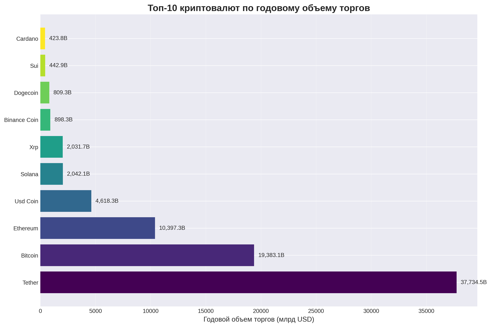

**Таблица 1. Топ-10 криптовалют по годовому объему торгов**

| №   | Криптовалюта | Годовой объем (млрд USD) |
| --- | ------------ | ------------------------ |
| 1   | Tether       | $37,734.5                |
| 2   | Bitcoin      | $19,383.1                |
| 3   | Ethereum     | $10,397.3                |
| 4   | Usd Coin     | $4,618.3                 |
| 5   | Solana       | $2,042.1                 |
| 6   | Xrp          | $2,031.7                 |
| 7   | Binance Coin | $898.3                   |
| 8   | Dogecoin     | $809.3                   |
| 9   | Sui          | $442.9                   |
| 10  | Cardano      | $423.8                   |

Диаграмма показывает значительную концентрацию объемов в топ-10 криптовалют, что свидетельствует о доминировании крупных игроков на рынке. Tether и Bitcoin занимают лидирующие позиции, что подчеркивает важность стабильных монет и первой криптовалюты в рыночной экосистеме.

## 2. Динамика цен криптовалют

Анализируем поведение цен различных криптовалют за последний год. Для сравнения криптовалют с разными ценовыми уровнями используем нормализацию:

$$P_{\text{норм}} = \frac{P - P_{\min}}{P_{\max} - P_{\min}}$$

где $P$ - цена закрытия, $P_{\min}$ и $P_{\max}$ - минимальная и максимальная цены за период.

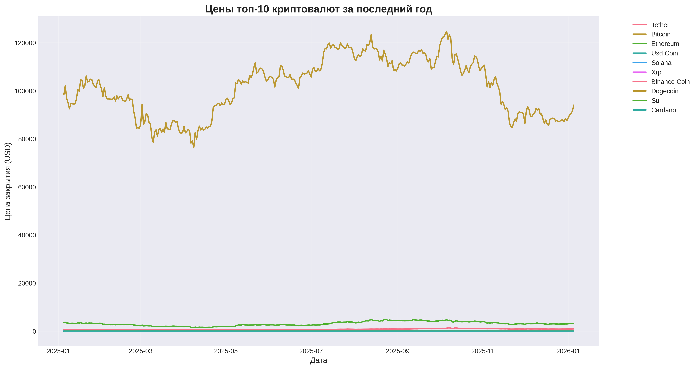

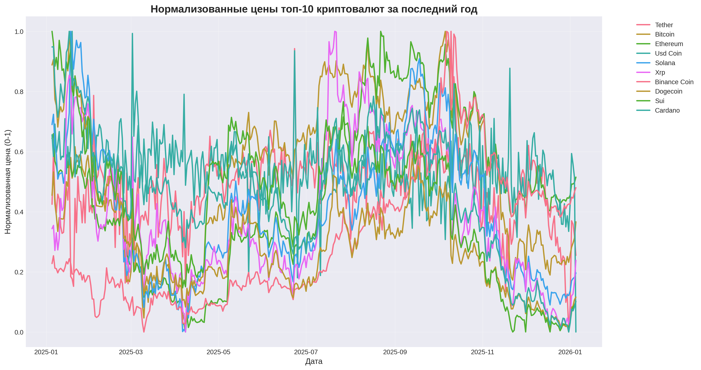

На графиках видно, что Bitcoin сохраняет лидерство по капитализации, в то время как Tether и Usd Coin демонстрируют стабильность цен. Высоковолатильные активы, такие как Solana и Dogecoin, показывают значительные колебания. Нормализация позволяет наглядно сравнить динамику разных криптовалют независимо от их абсолютных ценовых уровней.

## 3. Анализ волатильности

Оцениваем уровень риска различных криптовалют через расчет дневной волатильности:

$$\sigma_{\text{дневная}} = \frac{H - L}{C}$$

где $H$ - максимальная цена дня, $L$ - минимальная цена, $C$ - цена закрытия.

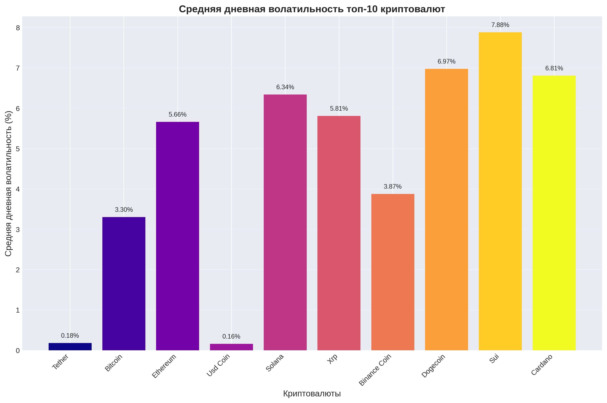

**Таблица 2. Средняя дневная волатильность**

| Криптовалюта | Волатильность (%) |
| ------------ | ----------------- |
| Tether       | 0.18%             |
| Bitcoin      | 3.30%             |
| Ethereum     | 5.66%             |
| Usd Coin     | 0.16%             |
| Solana       | 6.34%             |
| Xrp          | 5.81%             |
| Binance Coin | 3.87%             |
| Dogecoin     | 6.97%             |
| Sui          | 7.88%             |
| Cardano      | 6.81%             |

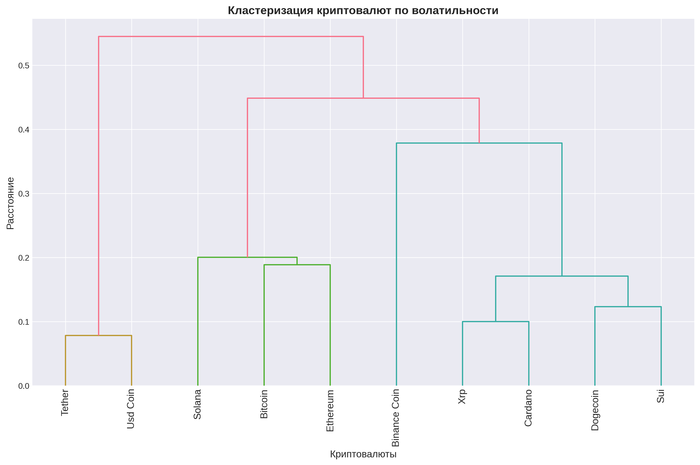

Криптовалюты демонстрируют широкий диапазон волатильности: от 0.16% для стабильных монет до 7.88% для высоковолатильных активов. Дендрограмма показывает, как криптовалюты группируются по схожему уровню риска, что полезно для построения диверсифицированных портфелей.

## 4. Корреляционный анализ цен

Изучаем взаимосвязи между ценами различных криптовалют. Для этого используем коэффициент корреляции Пирсона:

$$\rho_{XY} = \frac{\text{cov}(X,Y)}{\sigma_X \sigma_Y}$$

где $\text{cov}(X,Y)$ - ковариация между X и Y, $\sigma_X$ и $\sigma_Y$ - стандартные отклонения.

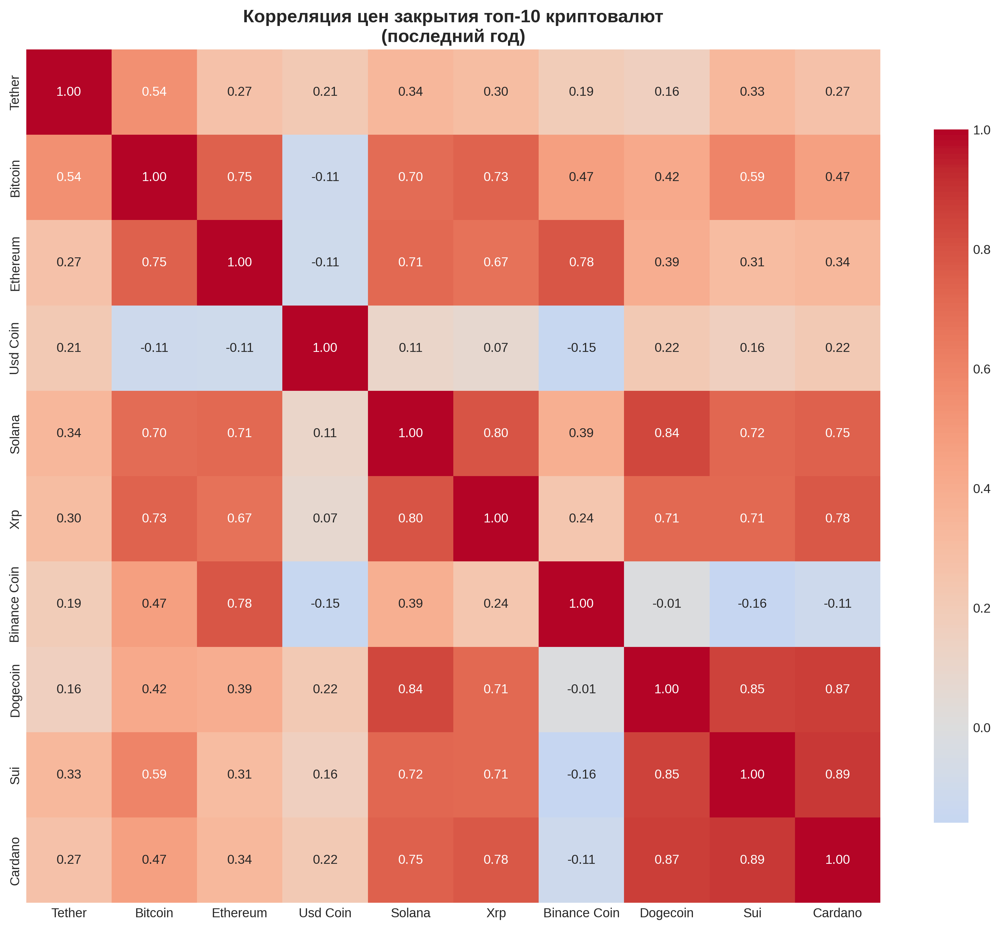

**Таблица 3. Топ-5 самых коррелированных пар (цены)**

| №   | Пара               | Корреляция |
| --- | ------------------ | ---------- |
| 1   | Sui - Cardano      | 0.886      |
| 2   | Dogecoin - Cardano | 0.872      |
| 3   | Dogecoin - Sui     | 0.854      |
| 4   | Solana - Dogecoin  | 0.836      |
| 5   | Solana - Xrp       | 0.796      |

Тепловая карта корреляций показывает сильные взаимосвязи между многими криптовалютами, особенно среди альткоинов. Высокие значения корреляции (близкие к 1) означают, что цены этих пар движутся синхронно, что важно учитывать при диверсификации инвестиционного портфеля.

## 5. Корреляционный анализ волатильности

Анализируем, насколько синхронно меняется рискованность разных криптовалют. Это помогает понять, формируются ли на рынке общие паттерны риска.

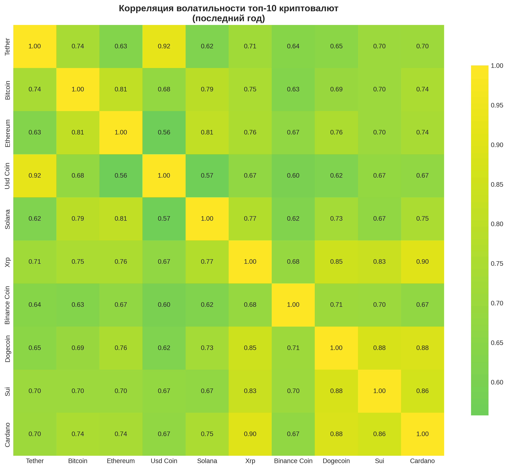

**Таблица 4. Топ-5 самых коррелированных пар (волатильность)**

| №   | Пара               | Корреляция |
| --- | ------------------ | ---------- |
| 1   | Tether - Usd Coin  | 0.922      |
| 2   | Xrp - Cardano      | 0.900      |
| 3   | Dogecoin - Cardano | 0.885      |
| 4   | Dogecoin - Sui     | 0.877      |
| 5   | Sui - Cardano      | 0.862      |

Интересно, что волатильность также демонстрирует высокую корреляцию между криптовалютами. Особенно сильная связь наблюдается между стабильными монетами (Tether и Usd Coin), что объясняется их схожей природой и функциями на рынке.

## 6. Прогнозирование методом линейной регрессии

Пытаемся спрогнозировать цены криптовалют на 30 дней вперед с использованием линейной регрессии:

$$y = \beta_0 + \beta_1 x + \epsilon$$

где $y$ - прогнозируемая цена, $x$ - время (номер дня), $\beta_0$ и $\beta_1$ - коэффициенты модели, $\epsilon$ - случайная ошибка.

Для оценки качества модели используем:

- MAE (Mean Absolute Error): средняя абсолютная ошибка
- MAPE (Mean Absolute Percentage Error): средняя абсолютная процентная ошибка
- R²: коэффициент детерминации

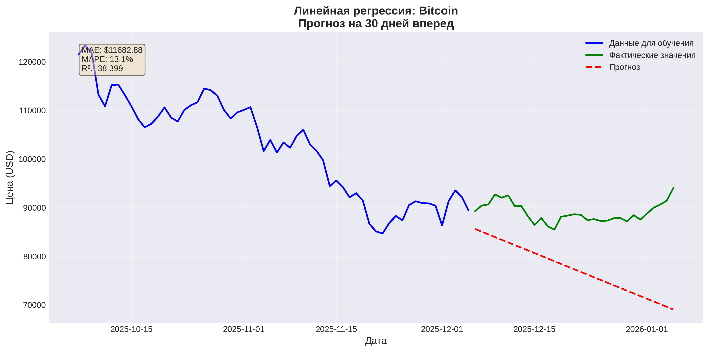

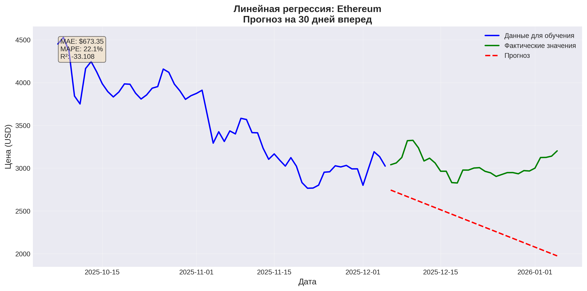

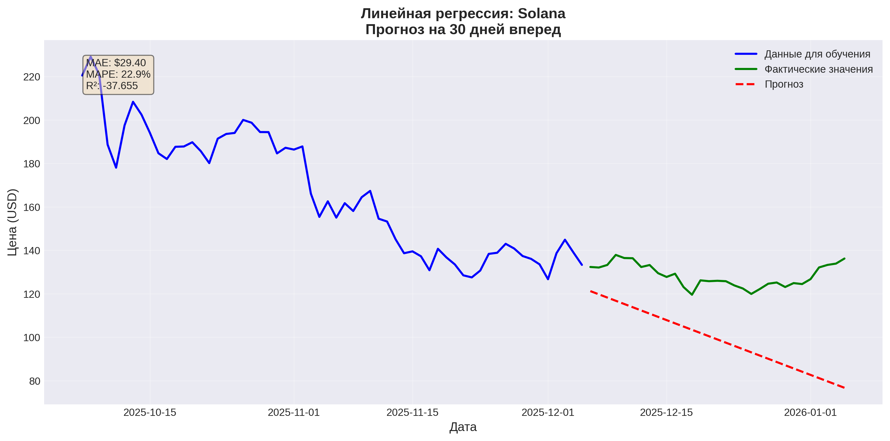

**Таблица 5. Результаты линейной регрессии (прогноз на 30 дней)**

| Криптовалюта | MAE (USD) | MAPE (%) | R²      |
| ------------ | --------- | -------- | ------- |
| Tether       | $0.00     | 0.0%     | -0.034  |
| Bitcoin      | $11682.88 | 13.1%    | -38.399 |
| Ethereum     | $673.35   | 22.1%    | -33.108 |
| Usd Coin     | $0.00     | 0.0%     | 0.126   |
| Solana       | $29.40    | 22.9%    | -37.655 |

В целом удалось спрогнозировать общее направление движения цен, однако линейная модель показывает ограниченную эффективность из-за высокой волатильности криптовалют. Отрицательные значения R² указывают на то, что для таких нестабильных активов требуются более сложные модели.

## 7. Анализ рисков и доходности

Оцениваем потенциальные риски и доходность инвестиций в разные криптовалюты. Рассчитываем максимальные просадки:

$$\text{Drawdown} = \frac{P_{\min} - P_{\max}}{P_{\max}} \times 100\%$$

и доходность за различные периоды:

$$\text{Return} = \left( \frac{P_{\text{конец}}}{P_{\text{начало}}} - 1 \right) \times 100\%$$

**Таблица 6. Максимальные месячные просадки и рост**

| Криптовалюта | Макс. просадка (%) | Макс. рост (%) |
| ------------ | ------------------ | -------------- |
| Tether       | -17.1%             | 20.6%          |
| Bitcoin      | -69.9%             | 232.5%         |
| Ethereum     | -66.8%             | 201.7%         |
| Usd Coin     | -57.5%             | 135.4%         |
| Solana       | -81.7%             | 445.8%         |

**Таблица 7. Доходность за разные периоды**

| Криптовалюта | 1 год (%) | 2 года (%) | 5 лет (%) |
| ------------ | --------- | ---------- | --------- |
| Tether       | -0.1%     | -0.1%      | -0.2%     |
| Bitcoin      | -4.4%     | 113.8%     | 155.4%    |
| Ethereum     | -11.9%    | 42.8%      | 165.3%    |
| Usd Coin     | -0.1%     | -0.1%      | -0.0%     |
| Solana       | -36.2%    | 45.1%      | 6961.4%   |

Анализ показывает классическое соотношение риск/доходность: высоковолатильные криптовалюты (Solana) демонстрируют как огромный потенциал доходности, так и значительные риски. Стабильные монеты обеспечивают сохранение капитала с минимальными колебаниями.

## 8. Анализ суммарных объемов торгов

Изучаем общую динамику объемов торгов на рынке криптовалют, что помогает понять общую рыночную активность.

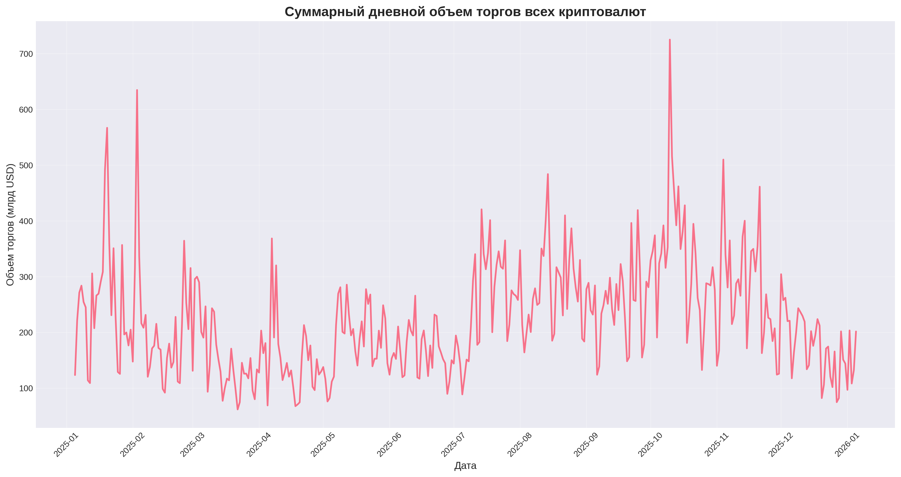

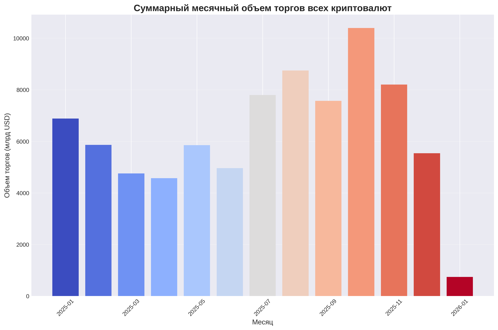

Графики показывают значительные колебания в суммарных объемах торгов. Пики объемов часто соответствуют периодам высокой волатильности, важным рыночным событиям или новостям, влияющим на всю криптоиндустрию.

## Заключение

Проведенный анализ позволяет сделать несколько ключевых выводов о рынке криптовалют:

1. **Концентрация ликвидности:** Большая часть торгового объема сосредоточена в топ-10 криптовалют, с явным доминированием Tether и Bitcoin.

2. **Широкий спектр рисков:** Рынок предлагает активы с совершенно разным профилем риска - от стабильных монет с волатильностью менее 0.2% до высокорисковых активов с волатильностью около 8%.

3. **Сильные корреляции:** Многие криптовалюты демонстрируют высокую степень синхронности в движении цен и волатильности, что необходимо учитывать при построении диверсифицированных портфелей.

4. **Сложность прогнозирования:** Традиционные линейные модели малопригодны для точного прогнозирования цен криптовалют из-за их нелинейности и высокой волатильности.

5. **Привлекательность для разных инвесторов:** Рынок предлагает возможности как для консервативных инвесторов (стабильные монеты), так и для агрессивных (высокодоходные волатильные активы).

Для дальнейших исследований рекомендуется использовать более сложные модели машинного обучения, учитывающие нелинейные зависимости и временные паттерны, а также расширить анализ за счет включения дополнительных факторов, таких как рыночные настроения, макроэкономические показатели и регуляторные изменения.

## Техническая реализация

Анализ выполнен с использованием языка программирования Python и следующих библиотек:

- **pandas** - обработка и анализ данных ([документация](https://pandas.pydata.org/docs/))
- **numpy** - численные вычисления ([документация](https://numpy.org/doc/))
- **matplotlib** и **seaborn** - визуализация ([matplotlib](https://matplotlib.org/stable/contents.html), [seaborn](https://seaborn.pydata.org/))
- **scipy** - статистические методы ([документация](https://docs.scipy.org/doc/scipy/))
- **scikit-learn** - машинное обучение ([документация](https://scikit-learn.org/stable/))
- Датасет [Top 50 Cryptocurrency Analysis](https://www.kaggle.com/code/nuhmanpk/top-50-cryptocurrency-analysis/notebook)
