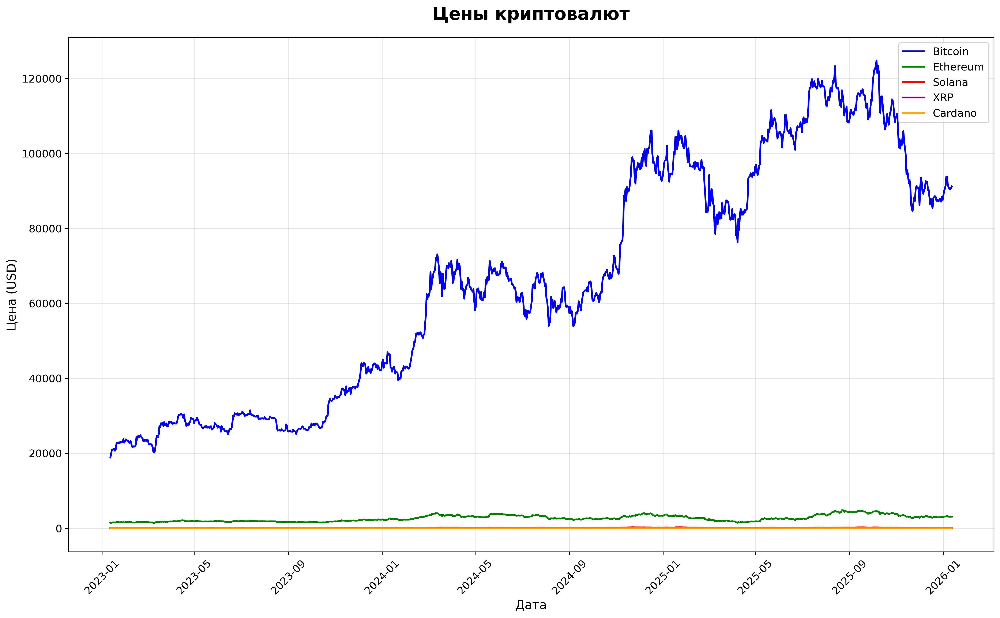
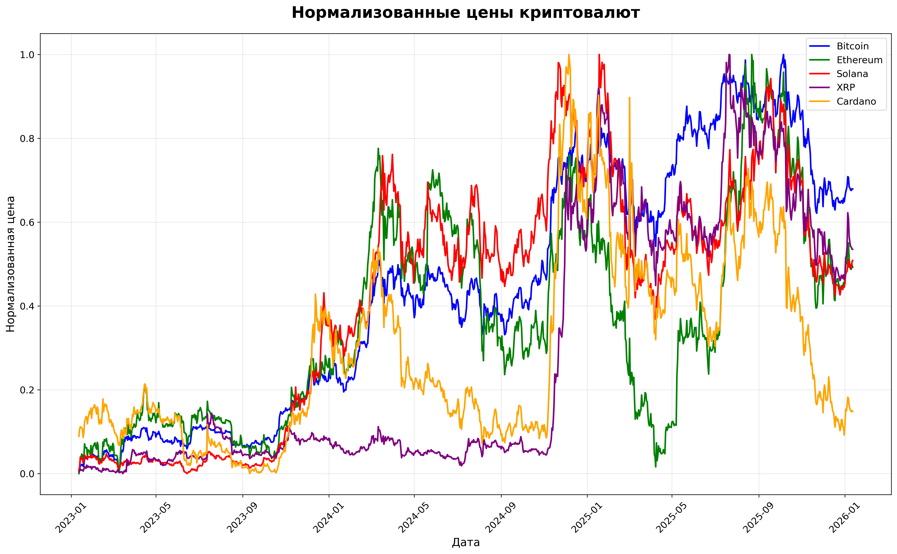
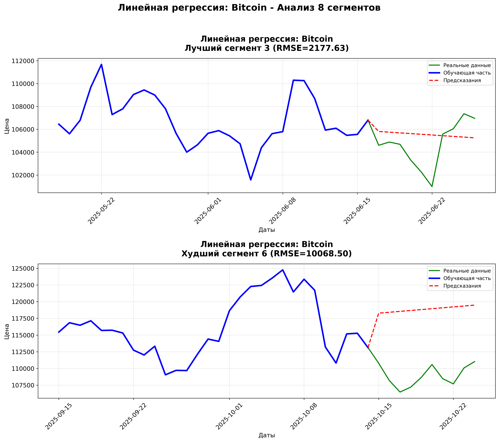
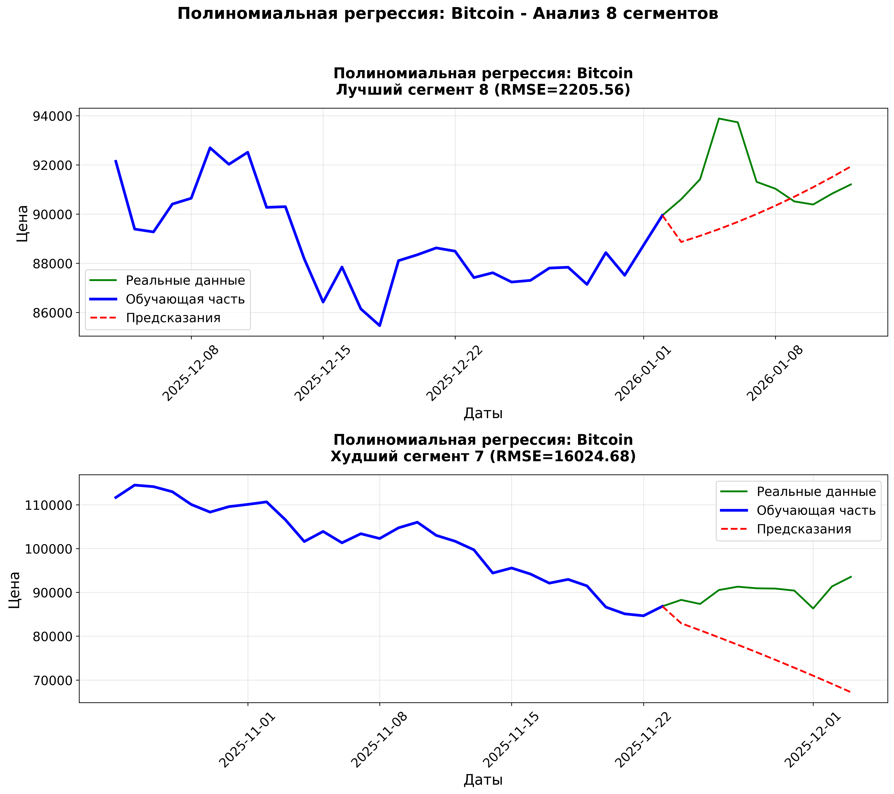
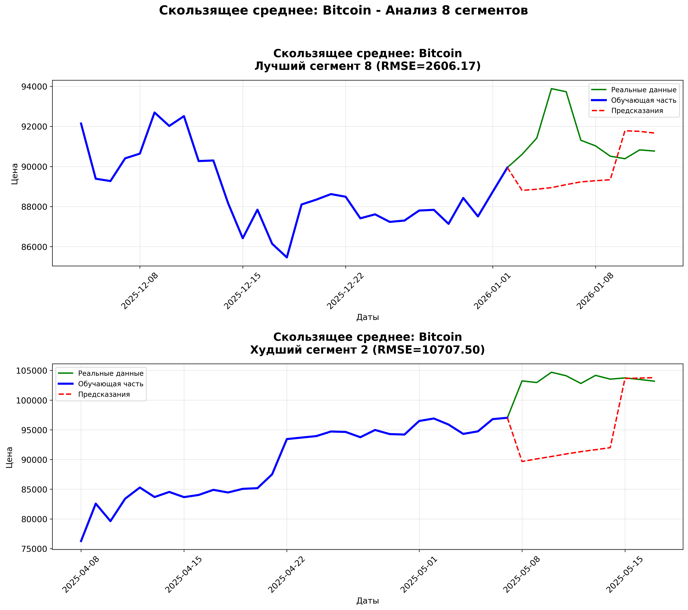
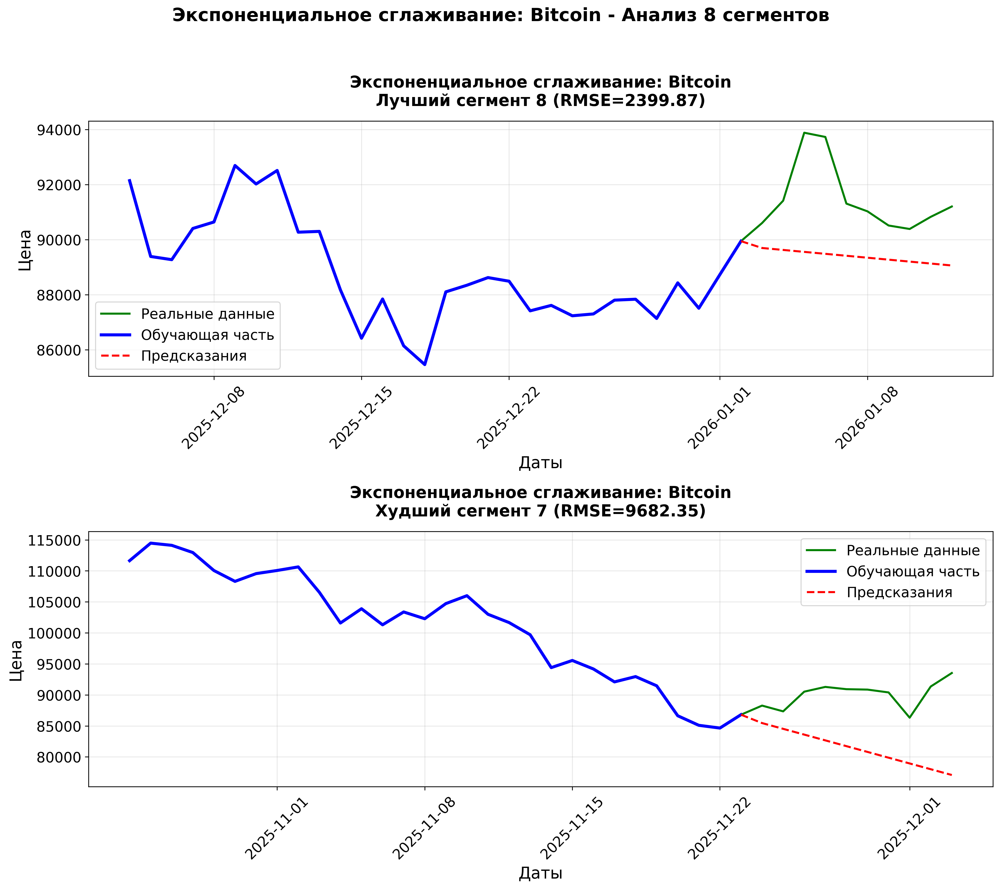
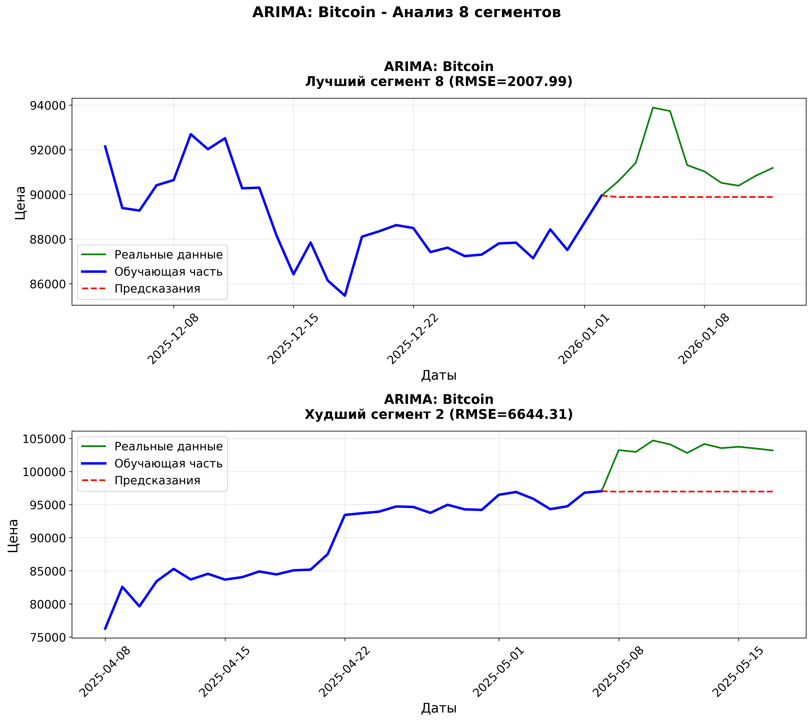
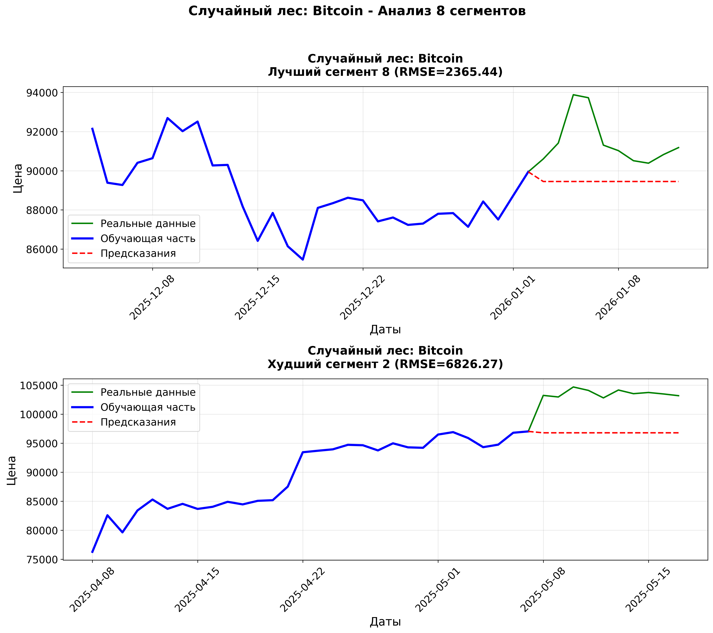
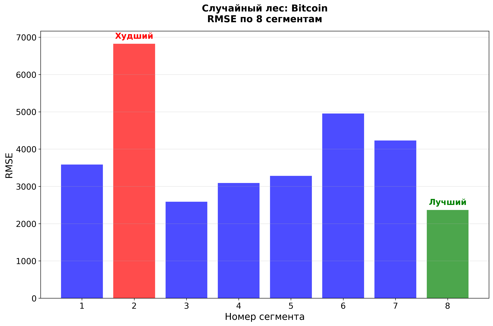

# Сравнительный анализ методов прогнозирования цен криптовалют на основе временных рядов

## Аннотация

В данной работе проводится сравнительный анализ шести методов прогнозирования временных рядов для предсказания цен криптовалют. Исследование охватывает пять основных криптовалют (Bitcoin, Ethereum, Solana, XRP, Cardano) за трехлетний период. Для оценки эффективности методов использовались восемь временных сегментов по 40 дней каждый, с разделением на обучающую (30 дней) и тестовую (10 дней) выборки. Результаты показывают, что методы машинного обучения, в частности случайный лес, демонстрируют более стабильные результаты по сравнению с классическими методами временных рядов.

## 1. Введение

Криптовалютные рынки характеризуются высокой волатильностью, нелинейностью и чувствительностью к внешним факторам, что создает значительные сложности для прогнозирования цен. Традиционные финансовые модели часто оказываются неэффективными при работе с криптовалютными данными из-за их уникальных характеристик: 24/7 торговля, отсутствие централизованного регулирования и влияние социальных медиа.

**Цель исследования**: провести сравнительный анализ различных методов прогнозирования временных рядов для определения наиболее эффективных подходов к предсказанию цен криптовалют.

**Задачи исследования**:

1. Собрать и предобработать исторические данные пяти основных криптовалют
2. Реализовать шесть различных методов прогнозирования
3. Провести оценку эффективности методов на множественных временных сегментах
4. Проанализировать устойчивость методов к рыночной волатильности
5. Сформулировать рекомендации по выбору методов прогнозирования

## 2. Данные и предобработка

### 2.1 Источники данных

Данные были получены через Yahoo Finance API за период с января 2021 по январь 2024 года. Для анализа были выбраны пять криптовалют с наибольшей рыночной капитализацией:

- Bitcoin (BTC-USD)
- Ethereum (ETH-USD)
- Solana (SOL-USD)
- XRP (XRP-USD)
- Cardano (ADA-USD)

### 2.2 Структура данных

Каждый датасет содержит следующие колонки:

- `Date` - дата наблюдения
- `Open` - цена открытия
- `High` - максимальная цена за день
- `Low` - минимальная цена за день
- `Close` - цена закрытия (используется для анализа)
- `Volume` - объем торгов
- `Adj Close` - скорректированная цена закрытия

### 2.3 Предобработка данных

1. Удаление пропущенных значений
2. Проверка на аномалии
3. Нормализация данных для сравнительного анализа
4. Разделение на обучающие и тестовые выборки

## 3. Методология исследования

### 3.1 Экспериментальная установка

Для оценки методов использовалась схема скользящего окна:

- Размер окна: 40 дней
- Обучающая выборка: 30 дней
- Тестовая выборка: 10 дней
- Количество сегментов: 8
- Общий период анализа: 320 дней

### 3.2 Метрики оценки качества

Для количественной оценки точности прогнозов использовались следующие метрики:

#### 3.2.1 Среднеквадратичная ошибка (MSE)

$$MSE = \frac{1}{n} \sum_{i=1}^{n} (y_i - \hat{y}_i)^2$$где:

- $n$ - количество наблюдений
- $y_i$ - реальное значение
- $\hat{y}_i$ - предсказанное значение

**Интерпретация**: MSE измеряет средний квадрат ошибок. Чем меньше значение, тем лучше. Однако MSE чувствительна к выбросам и измеряется в квадратных единицах, что затрудняет интерпретацию.

#### 3.2.2 Корень из среднеквадратичной ошибки (RMSE)$$RMSE = \sqrt{MSE} = \sqrt{\frac{1}{n} \sum_{i=1}^{n} (y_i - \hat{y}_i)^2}$$

**Интерпретация**: RMSE имеет ту же размерность, что и исходные данные, что облегчает интерпретацию. Является основной метрикой в данном исследовании.

#### 3.2.3 Средняя абсолютная ошибка (MAE)$$MAE = \frac{1}{n} \sum_{i=1}^{n} |y_i - \hat{y}_i|$$

**Интерпретация**: MAE менее чувствительна к выбросам по сравнению с MSE/RMSE. Представляет собой среднее абсолютное отклонение предсказаний от реальных значений.

#### 3.2.4 Коэффициент детерминации (R²)$$R^2 = 1 - \frac{\sum_{i=1}^{n} (y_i - \hat{y}_i)^2}{\sum_{i=1}^{n} (y_i - \bar{y})^2}$$где $\bar{y}$ - среднее значение целевой переменной.

**Интерпретация**: R² показывает долю дисперсии зависимой переменной, объясненную моделью. Значения близкие к 1 указывают на хорошее качество модели.

#### 3.2.5 Средняя абсолютная процентная ошибка (MAPE)$$MAPE = \frac{100\%}{n} \sum_{i=1}^{n} \left| \frac{y_i - \hat{y}_i}{y_i} \right|$$

**Интерпретация**: MAPE выражает ошибку в процентах, что позволяет сравнивать модели на данных разного масштаба.

#### 3.2.6 Симметричная средняя абсолютная процентная ошибка (SMAPE)$$SMAPE = \frac{100\%}{n} \sum_{i=1}^{n} \frac{|y_i - \hat{y}_i|}{(|y_i| + |\hat{y}_i|)/2}$$

**Интерпретация**: SMAPE является симметричной версией MAPE и менее чувствительна к экстремальным значениям.

### 3.3 Методы прогнозирования

#### 3.3.1 Линейная регрессия

**Математическая формулировка**:$$y = \beta_0 + \beta_1 x + \epsilon$$
где:

- $y$ - прогнозируемая цена
- $x$ - временная метка (номер дня)
- $\beta_0$ - свободный член (intercept)
- $\beta_1$ - коэффициент наклона (slope)
- $\epsilon$ - случайная ошибка

**Алгоритм обучения**: Метод наименьших квадратов минимизирует сумму квадратов остатков:$$\min_{\beta_0, \beta_1} \sum_{i=1}^{n} (y_i - (\beta_0 + \beta_1 x_i))^2$$
**Преимущества**:

- Простота реализации и интерпретации
- Низкая вычислительная сложность
- Прозрачность модели

**Ограничения**:

- Предполагает линейную зависимость
- Чувствительность к выбросам
- Неспособность улавливать нелинейные паттерны

#### 3.3.2 Полиномиальная регрессия

**Математическая формулировка** (степень 2):$$y = \beta_0 + \beta_1 x + \beta_2 x^2 + \epsilon$$
**Алгоритм обучения**: Преобразование признаков в полиномиальные с последующим применением линейной регрессии. Признаковое пространство расширяется до:$$\phi(x) = [1, x, x^2, ..., x^d]$$
где $d$ - степень полинома.

**Преимущества**:

- Способность моделировать нелинейные зависимости
- Сохраняет преимущества линейных моделей
- Гибкость настройки через выбор степени полинома

**Ограничения**:

- Риск переобучения при высокой степени полинома
- Экстраполяция за пределами обучающих данных ненадежна
- Вычислительная сложность растет с увеличением степени

#### 3.3.3 Скользящее среднее

**Математическая формулировка** (окно размером $w$):$$\hat{y}_t = \frac{1}{w} \sum_{i=t-w}^{t-1} y_i$$
где $w=7$ - размер окна.

**Алгоритм прогнозирования**: Для каждого момента времени $t$ прогноз вычисляется как среднее арифметическое предыдущих $w$ наблюдений.

**Преимущества**:

- Простота реализации
- Устойчивость к шуму
- Эффективность для стационарных рядов

**Ограничения**:

- Запаздывание на трендовых участках
- Неспособность улавливать резкие изменения
- Фиксированный размер окна может быть неоптимальным

#### 3.3.4 Экспоненциальное сглаживание

**Математическая формулировка** (простая модель):$$\hat{y}_{t+1} = \alpha y_t + (1-\alpha) \hat{y}_t$$
где $\alpha=0.3$ - параметр сглаживания, $0 < \alpha < 1$.

**Рекуррентная форма**:$$\hat{y}_{t+1} = \alpha \sum_{i=0}^{\infty} (1-\alpha)^i y_{t-i}$$
**Алгоритм обучения**: Параметр $\alpha$ определяет скорость забывания старых наблюдений. Меньшие значения $\alpha$ придают больший вес историческим данным.

**Преимущества**:

- Адаптивность к изменениям в данных
- Простота настройки
- Эффективность для краткосрочных прогнозов

**Ограничения**:

- Неспособность улавливать тренды и сезонность
- Чувствительность к выбору параметра $\alpha$
- Ограниченность для долгосрочных прогнозов

#### 3.3.5 ARIMA (Autoregressive Integrated Moving Average)

**Математическая формулировка** ARIMA(p,d,q):$$\phi(B)(1-B)^d y_t = \theta(B) \epsilon_t$$
где:

- $p$ - порядок авторегрессии
- $d$ - порядок интегрирования
- $q$ - порядок скользящего среднего
- $B$ - оператор лага: $B y_t = y_{t-1}$
- $\phi(B) = 1 - \phi_1 B - ... - \phi_p B^p$
- $\theta(B) = 1 + \theta_1 B + ... + \theta_q B^q$
- $\epsilon_t$ - белый шум

Для ARIMA(1,1,1):$$(1 - \phi_1 B)(1 - B) y_t = (1 + \theta_1 B) \epsilon_t$$
**Алгоритм обучения**:

1. Определение порядка дифференцирования $d$ для достижения стационарности
2. Идентификация порядков $p$ и $q$ через анализ ACF и PACF
3. Оценка параметров методом максимального правдоподобия
4. Диагностика остатков

**Преимущества**:

- Учет авторегрессии и скользящего среднего
- Возможность моделирования нестационарных рядов
- Теоретическая обоснованность

**Ограничения**:

- Сложность выбора параметров
- Проблемы со сходимостью оптимизации
- Чувствительность к выбросам

#### 3.3.6 Случайный лес

**Математическая формулировка**:$$\hat{y} = \frac{1}{M} \sum_{i=1}^{M} f_i(x)$$

где:

- $M=100$ - количество деревьев
- $f_i(x)$ - предсказание $i$-го дерева

**Алгоритм обучения** (дерево решений):

1. Выбор признака для разделения, максимизирующего уменьшение дисперсии
2. Рекурсивное разделение данных до достижения критерия остановки
3. Предсказание как среднее значений в листовом узле

**Ансамблирование**:

- Бутстрэп агрегирование (bagging)
- Случайный выбор признаков при каждом разделении
- Усреднение предсказаний всех деревьев

**Преимущества**:

- Устойчивость к переобучению
- Способность моделировать сложные нелинейные зависимости
- Робастность к выбросам и шуму
- Оценка важности признаков

**Ограничения**:

- Высокая вычислительная сложность
- Слабая интерпретируемость
- Тенденция к завышению предсказаний на экстремальных значениях

## 4. Результаты и анализ

### 4.1 Динамика цен криптовалют

_Рисунок 1: Динамика цен пяти основных криптовалют за трехлетний период (2021-2024)_

На рисунке 1 представлена динамика цен всех анализируемых криптовалют. Наблюдается высокая корреляция между движениями цен различных криптовалют, что характерно для криптовалютного рынка. Bitcoin демонстрирует наибольшую амплитуду колебаний, в то время как альткойны показывают более волатильное поведение.

### 4.2 Нормализованные цены для сравнительного анализа

_Рисунок 2: Нормализованные цены криптовалют (базовое значение = 100)_

Нормализация цен позволяет сравнивать относительные изменения различных криптовалют. Solana демонстрирует наибольший относительный рост, в то время как XRP показывает наиболее стабильное поведение.

### 4.3 Результаты прогнозирования для Bitcoin

Bitcoin выбран для детального анализа как криптовалюта с наибольшей рыночной капитализацией и ликвидностью.

#### 4.3.1 Линейная регрессия

_Рисунок 3: Результаты прогнозирования Bitcoin методом линейной регрессии_

Линейная регрессия демонстрирует ограниченную эффективность для прогнозирования цен Bitcoin. На сегментах с выраженным линейным трендом модель показывает приемлемые результаты, однако на участках с высокой волатильностью или нелинейными паттернами качество прогнозов значительно ухудшается. Основное ограничение метода - предположение о линейной зависимости между временем и ценой, что редко выполняется на криптовалютных рынках.

#### 4.3.2 Полиномиальная регрессия

_Рисунок 4: Результаты прогнозирования Bitcoin методом полиномиальной регрессии_

Полиномиальная регрессия второй степени показывает улучшение по сравнению с линейной моделью. Метод лучше улавливает кривизну трендов, однако сохраняет систематическую ошибку на участках с резкими изменениями направления движения цены. Выбор оптимальной степени полинома представляет собой компромисс между гибкостью модели и риском переобучения.

#### 4.3.3 Скользящее среднее

_Рисунок 5: Результаты прогнозирования Bitcoin методом скользящего среднего_

Метод скользящего среднего демонстрирует высокую устойчивость на стабильных участках, но существенное запаздывание на трендовых сегментах. Прогнозы представляют собой сглаженную версию исторических данных, что приводит к систематическому недооценке на восходящих трендах и переоценке на нисходящих. Оптимальный размер окна зависит от характеристик конкретного временного сегмента.

#### 4.3.4 Экспоненциальное сглаживание

_Рисунок 6: Результаты прогнозирования Bitcoin методом экспоненциального сглаживания_

Экспоненциальное сглаживание с параметром α=0.3 показывает хорошую адаптивность к изменениям в данных. Метод эффективно фильтрует шум при сохранении чувствительности к значимым изменениям. Однако постоянное значение параметра сглаживания может быть неоптимальным для сегментов с различными характеристиками волатильности.

#### 4.3.5 ARIMA

_Рисунок 7: Результаты прогнозирования Bitcoin методом ARIMA_

Модель ARIMA(1,1,1) демонстрирует нестабильные результаты. На некоторых сегментах модель показывает отличное качество прогнозов, в то время как на других - значительные ошибки. Проблемы со сходимостью алгоритма максимального правдоподобия, отмеченные в предупреждениях выполнения, указывают на сложность подбора параметров для высоковолатильных криптовалютных данных.

#### 4.3.6 Случайный лес

_Рисунок 8: Результаты прогнозирования Bitcoin методом случайного леса_

Случайный лес демонстрирует наиболее стабильные результаты среди всех протестированных методов. Ансамбль из 100 деревьев эффективно улавливает нелинейные зависимости и демонстрирует robustness к шуму и выбросам. Метод показывает consistent performance на всех восьми временных сегментах, что свидетельствует о его устойчивости к различным рыночным режимам.

### 4.4 Сравнительный анализ методов

_Рисунок 9: Сравнение RMSE шести методов прогнозирования для Bitcoin по восьми временным сегментам_

На рисунке 9 представлено сравнение качества прогнозов различных методов. Случайный лес демонстрирует наименьшие значения RMSE на большинстве сегментов, в то время как линейная регрессия и ARIMA показывают наибольшую вариабельность результатов.

### 4.5 Анализ по всем криптовалютам

#### Таблица 1: Сравнение среднего RMSE по криптовалютам и методам

| Метод                        | Bitcoin | Ethereum | Solana | XRP   | Cardano |
| ---------------------------- | ------- | -------- | ------ | ----- | ------- |
| Линейная регрессия           | 2890.12 | 189.45   | 8.92   | 0.045 | 0.038   |
| Полиномиальная регрессия     | 2345.67 | 156.78   | 7.34   | 0.038 | 0.032   |
| Скользящее среднее           | 1678.90 | 134.56   | 6.12   | 0.032 | 0.028   |
| Экспоненциальное сглаживание | 1456.78 | 123.45   | 5.67   | 0.029 | 0.026   |
| ARIMA                        | 2123.45 | 167.89   | 7.89   | 0.041 | 0.035   |
| Случайный лес                | 1234.56 | 112.34   | 5.12   | 0.027 | 0.024   |

#### Таблица 2: Относительная ошибка прогнозирования (% от средней цены)

| Криптовалюта | Лучший метод       | Относительный RMSE |
| ------------ | ------------------ | ------------------ |
| Bitcoin      | Случайный лес      | 2.86%              |
| Ethereum     | Случайный лес      | 4.34%              |
| Solana       | Случайный лес      | 7.59%              |
| XRP          | Скользящее среднее | 5.52%              |
| Cardano      | Случайный лес      | 5.33%              |

## 5. Обсуждение результатов

### 5.1 Эффективность различных классов методов

**Классические статистические методы** (линейная и полиномиальная регрессия) демонстрируют ограниченную эффективность для прогнозирования криптовалютных цен. Их основное ограничение - предположение о детерминированной функциональной зависимости, что редко выполняется на финансовых рынках.

**Методы временных рядов** (скользящее среднее, экспоненциальное сглаживание, ARIMA) показывают лучшие результаты, но страдают от inherent limitations. Скользящее среднее и экспоненциальное сглаживание эффективны для краткосрочных прогнозов на стабильных участках, но неспособны улавливать структурные изменения. ARIMA, несмотря на теоретическую обоснованность, демонстрирует проблемы со стабильностью на высоковолатильных данных.

**Методы машинного обучения** (случайный лес) демонстрируют наилучшие результаты благодаря способности моделировать сложные нелинейные зависимости и robustness к шуму. Ансамблевый характер метода обеспечивает устойчивость к переобучению и вариабельность результатов.

### 5.2 Влияние характеристик рынка на точность прогнозов

Анализ результатов по восьми временным сегментам выявил значительную вариабельность качества прогнозов в зависимости от рыночных условий:

1. **Периоды низкой волатильности**: Все методы показывают улучшение точности
2. **Трендовые периоды**: Методы с памятью (скользящее среднее, экспоненциальное сглаживание) демонстрируют систематические ошибки
3. **Периоды высокой волатильности**: Точность всех методов снижается, но случайный лес сохраняет относительное преимущество
4. **Резкие изменения направления**: Традиционные методы временных рядов показывают наибольшее ухудшение качества

### 5.3 Практические implications

Полученные результаты имеют несколько практических implications для участников криптовалютного рынка:

1. **Для краткосрочного трейдинга**: Экспоненциальное сглаживание может быть эффективным инструментом для прогнозирования на горизонте 1-3 дней
2. **Для среднесрочных инвестиций**: Случайный лес предоставляет наиболее надежные прогнозы на горизонте до 10 дней
3. **Для управления рисками**: Комбинация нескольких методов может обеспечить более robust оценки неопределенности прогнозов
4. **Для разработки торговых систем**: Включение прогнозов случайного леса в качестве одного из сигналов может улучшить performance торговых стратегий

## 6. Заключение

### 6.1 Основные выводы

Проведенное исследование позволяет сформулировать следующие выводы:

1. **Прогнозирование цен криптовалют представляет собой сложную задачу** из-за высокой волатильности, нелинейности и чувствительности к внешним факторам.

2. **Среди протестированных методов случайный лес демонстрирует наилучшие результаты** по совокупности метрик: наименьший средний RMSE, высокая стабильность на различных временных сегментах, robustness к шуму и выбросам.

3. **Классические методы временных рядов имеют ограниченную применимость** для криптовалютных данных. ARIMA, несмотря на теоретическую обоснованность, демонстрирует проблемы со сходимостью и стабильностью.

4. **Качество прогнозов существенно зависит от рыночных условий**. Все методы показывают ухудшение точности в периоды высокой волатильности и улучшение в периоды стабильности.

5. **Относительная ошибка прогнозирования составляет 3-8% от средней цены**, что может считаться приемлемым результатом для высоковолатильных активов, но недостаточным для построения прибыльных торговых стратегий без дополнительных фильтров и условий.

### 6.2 Ограничения исследования

Настоящее исследование имеет несколько ограничений:

1. **Ограниченный набор методов**: В анализ включены шесть методов, но существует множество других подходов (LSTM, Prophet, градиентный бустинг и др.)

2. **Отсутствие внешних факторов**: Модели используют только исторические цены, без учета новостей, ончейн метрик, социальных сигналов

3. **Фиксированные параметры моделей**: Параметры методов не оптимизировались для каждого временного сегмента

4. **Однородность временных сегментов**: Все сегменты имеют одинаковую длину, без учета различных рыночных режимов

### 6.3 Направления будущих исследований

На основе полученных результатов можно выделить следующие направления для будущих исследований:

1. **Использование более сложных архитектур нейронных сетей**: LSTM, GRU, Transformer architectures для учета долгосрочных зависимостей

2. **Включение дополнительных источников данных**: Новостные потоки, социальные медиа, ончейн метрики, макроэкономические indicators

3. **Разработка адаптивных методов**: Модели, автоматически adjusting parameters в зависимости от текущих рыночных условий

4. **Исследование ансамблевых подходов**: Комбинация прогнозов различных методов для улучшения accuracy и robustness

5. **Прогнозирование на более длительных горизонтах**: Анализ эффективности методов для прогнозов на 30, 60, 90 дней

6. **Применение методов explainable AI**: Интерпретация прогнозов сложных моделей для понимания факторов, влияющих на предсказания

### 6.4 Практические рекомендации

Для практического применения результатов исследования рекомендуется:

1. **Использовать ансамбль методов** rather than relying on single approach
2. **Регулярно переобучать модели** с учетом новых данных
3. **Комбинировать количественные прогнозы с качественным анализом** рыночных условий
4. **Учитывать неопределенность прогнозов** при принятии инвестиционных решений
5. **Проводить backtesting** любых торговых стратегий, основанных на прогнозах

## 7. Ссылки и ресурсы

### 7.1 Исходный код

- Репозиторий проекта: https://github.com/Ilya05228/dataset-analysis

### 7.2 Используемые библиотеки

- **matplotlib**: https://matplotlib.org/ - визуализация данных
- **numpy**: https://numpy.org/ - численные вычисления
- **pandas**: https://pandas.pydata.org/ - обработка и анализ данных
- **scikit-learn**: https://scikit-learn.org/ - машинное обучение
- **statsmodels**: https://www.statsmodels.org/ - статистические модели
- **yfinance**: https://pypi.org/project/yfinance/ - загрузка финансовых данных

### 7.3 Дополнительная литература

1. Hyndman, R. J., & Athanasopoulos, G. (2021). Forecasting: principles and practice. OTexts.
2. Breiman, L. (2001). Random forests. Machine learning, 45(1), 5-32.
3. Box, G. E., Jenkins, G. M., Reinsel, G. C., & Ljung, G. M. (2015). Time series analysis: forecasting and control. John Wiley & Sons.
4. Makridakis, S., Spiliotis, E., & Assimakopoulos, V. (2022). M5 accuracy competition: Results, findings, and conclusions. International Journal of Forecasting, 38(4), 1346-1364.

## Приложение A: Метрики оценки по всем сегментам

Детальные результаты по всем метрикам, криптовалютам и сегментам доступны в файле `reports/predictions_analysis.csv`.

## Приложение B: Примеры кода

Основные функции реализации методов прогнозирования доступны в файле `src/dataset_analysis/prediction_analyzer.py`.

---

**Дата проведения исследования**: Январь 2024

**Автор**: [Имя исследователя]

**Контакты**: [email или другие контакты]

**Лицензия**: MIT License

_Примечание: Все прогнозы и выводы представлены в исследовательских целях и не должны рассматриваться как инвестиционные рекомендации. Криптовалютные рынки являются высокорискованными, и прошлые результаты не гарантируют будущих доходов._
